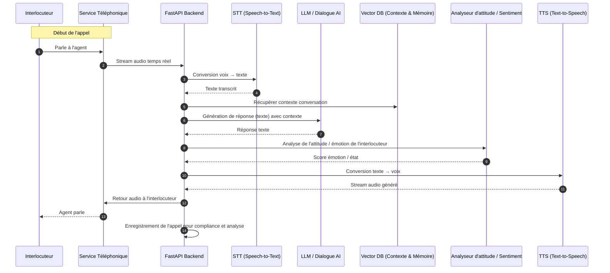
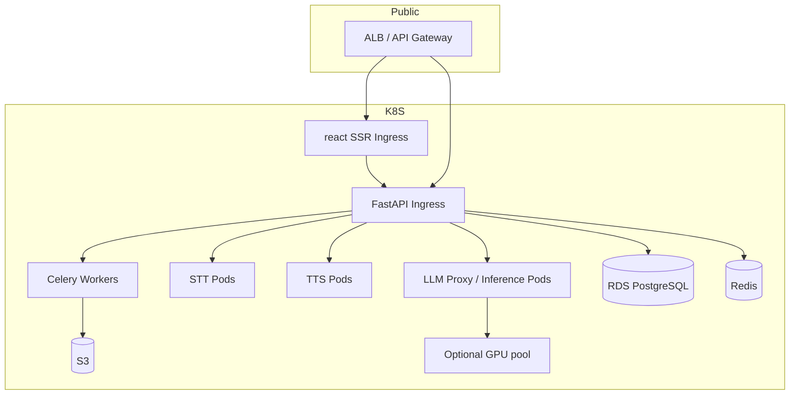

# Architecture technique — SaaS d'agents voice-to-voice (react + FastAPI)

> Document technique complet — diagrammes, flux en temps réel, composants, API, infra et roadmap d'implémentation.

---

## Objectif
Cette plateforme SaaS permet de créer, configurer, tester et déployer des **agents AI capables de mener des appels téléphoniques voice-to-voice** (interaction humaine-like).  
L'architecture est conçue pour être **modulaire, orientée événements, scalable et sécurisée**, avec un focus sur la **latence minimale** et l'**observabilité**.

---

## 1.Composants principaux

### Frontend (React)
- Console de configuration des agents.
- Dashboard en temps réel pour le suivi des appels et performances.
- Simulateur d'appel pour tester les agents avant déploiement.

### Backend (FastAPI)
- **API REST** pour gérer les agents, les scripts et la configuration.
- **WebSocket** pour le streaming temps réel des interactions vocales.
- Orchestrateur d'appels et gestion de sessions.
- Intégration avec les services téléphoniques (Twilio, Vonage, SIP Trunk).

> ⚡ FastAPI est un **framework Python moderne et performant**, orienté vers la création d'API REST et WebSocket asynchrones, idéal pour gérer des flux temps réel et scalable.

### Pipeline Voix-AI
- **STT (Speech-to-Text)** : conversion de la voix en texte.
- **LLM (Dialogue AI)** : génération de réponses et analyse du dialogue.  
  *L’agent répond uniquement aux questions liées au sujet X, et ignore ou redirige les questions hors-sujet.*
- **TTS (Text-to-Speech)** : génération vocale humaine-like, en streaming pour une latence minimale.
- Les appels peuvent être **enregistrés** pour analyse, compliance et amélioration des agents.
- **Vector DB** : stockage du contexte et mémoire des conversations pour améliorer la continuité du dialogue avec un LLM complexe.  
  *Utilisée pour le RAG (Retrieval-Augmented Generation) : le LLM récupère des informations pertinentes du passé pour enrichir la conversation en temps réel.*
- **Analyseur d'attitude / sentiment** : détection de l'état émotionnel de l'interlocuteur en temps réel.


### Services téléphoniques
- Twilio / Vonage / SIP Trunk pour **terminer les appels vers le réseau téléphonique**.
- Support des flux media en streaming pour STT/TTS.

### Infrastructure
- Conteneurisation avec **Docker**.
- Orchestration et scalabilité via **Kubernetes (EKS/GKE/AKS)**.
- Load balancers pour gérer la charge.
- **CI/CD** pour déploiement continu et automatisé.

### Observabilité et sécurité
- **Prometheus & Grafana** : métriques et monitoring.
- **Loki** : centralisation des logs.
- **Sentry** : suivi des erreurs et exceptions.
- **OpenTelemetry / Jaeger** (optionnel) : traçage distribué pour le pipeline temps réel.
- Sécurisation des données et appels via chiffrement, gestion des secrets et IAM.
- **Gestion du consentement et de la compliance** pour l'enregistrement et la conservation des appels.

---

## 2.Flux simplifié d’un appel


---

## 3. Diagramme d'architecture (haut niveau)

```mermaid
flowchart LR
subgraph CLIENT
A[Console React] -->|REST| B(API FastAPI)
A -->|WebSocket| WS(FastAPI_WS)
A -->|Simulation d'appels| SIM(Simulateur d'appels)
end

subgraph BACKEND
B --> DB[(PostgreSQL)]
B --> RQ[Queue de tâches]
B --> TELE[Adaptateur Téléphonie]
B --> ORCH[Orchestrateur d'agents]
WS --> ORCH
ORCH --> STT[Service STT]
ORCH --> LLM[Service LLM]
ORCH --> TTS[Service TTS]
ORCH --> SENT[Analyseur d'attitude / sentiment]
ORCH --> VectorDB[Vector DB (contexte)]
ORCH --> RQ
end

TELE -->|SIP / Twilio| PSTN[(PSTN / Fournisseur Télécom)]
STT --> LLM
LLM --> VectorDB
LLM --> TTS
TTS --> TELE
SENT --> ORCH
DB --- OL[Observabilité (Prometheus / Grafana / Loki / Sentry)]
RQ --> WORKERS[Workers]
WORKERS --> OL

```

---

## 4. Composants détaillés

### Frontend — react

- Pages / Features :
  - **Agents** : création, édition (personnalité, scripts, fallback rules, NLU intents, slot filling).
  - **Simulator** : initier un appel (microphone) ou playback pour tester flows.
  - **Dashboard realtime** : liste d'appels en cours, transcription en direct, sentiment/metrics.
  - **Analytics** : KPIs, heatmaps des scripts, taux de réussite, durée moyenne d'appel.
  - **Auth & Admin** : SSO/OAuth2, roles (admin, client, support).
- Tech & UX : Server-side rendering pour pages publiques, SPA pour console, WebSockets (socket.io ou native WS) pour realtime.
- Stockage local : IndexedDB pour drafts de scripts.

### Backend — FastAPI

- Entrées : REST API (agents, comptes, templates), Webhooks (telephony), WebSockets (UI realtime).
- Modules :
  - **Auth** : JWT + refresh tokens, RBAC.
  - **Agent Manager** : CRUD agents, versioning, publish/unpublish.
  - **Call Orchestrator** : state machine pour chaque appel (connexion, greeting, intent, fallback, hangup).
  - **Telephony Adapter** : drivers pour Twilio, Vonage, et generic SIP.
  - **AI Pipeline** : gestion des streams STT/LLM/TTS; adaptation selon fournisseur.
  - **Queue** : tâches longues (post-processing, recordings, fine-tune jobs) avec Celery/RQ.
  - **Storage** : S3-compatible pour enregistrements audio et assets.
- DB : PostgreSQL (relations : users, accounts, agents, flows, calls, transcripts, events).

### Telephony Service

- Options recommandées : Twilio (programmability & streaming), Vonage (voice API), ou SIP Trunk vers carrier.
- Fonction : acheminer appel depuis PSTN -> plateforme (webhook / websocket), streamer audio en chunk -> Orchestrator.

### AI Pipeline

- **STT (Streaming)** : Whisper (open-source) pour batch, Deepgram or AssemblyAI for low-latency streaming.
- **LLM** : modèle conversationnel (inference endpoint). Approches :
  - Instruction-following LLM (Anthropic/Meta/OPENAI) + system prompt + retrieval from memory.
  - Fine-tuned LLMs pour domaine si besoin (privacy/latency tradeoff).
- **TTS** : Azure Neural TTS, ElevenLabs, or Amazon Polly Neural for realistic voice.
- **Latency pattern** : choose streaming providers that support chunk-by-chunk streaming to cut roundtrip.

### Orchestration & State Machine

- Per-call state machine (ex: `INIT -> GREETING -> LISTEN -> PROCESS -> RESPOND -> END`).
- Context & memory : short-term (per-call context) + long-term memory (customer profile, past calls) saved in DB or vector DB (Weaviate/Pinecone) for retrieval-augmented generation (RAG).
- Fallbacks & Escalation : escalate to human live agent via SIP transfer or create a support ticket.

### Background tasks

- Recording transcription, sentiment analysis, call summarization, analytics aggregation, model fine-tuning jobs.
- Use Celery (RabbitMQ/Redis broker) or RQ for simplicity.

### Realtime

- WebSockets (FastAPI + `websockets` or `starlette` WS) to push transcriptions, audio events, and call states to the frontend.
- Optional: use a pub/sub layer (Redis Streams or Kafka) to fan-out events to multiple subscribers (UI, analytics, alerting).
---

## 5. Modèle de données (extraits)

- **users**: id, account_id, email, hashed_password, role, created_at
- **accounts**: id, name, billing_info, plan_tier
- **agents**: id, account_id, name, voice_profile, personality_config(json), published_version
- **flows**: id, agent_id, nodes(json), transitions(json)
- **calls**: id, agent_id, account_id, started_at, ended_at, status
- **transcripts**: id, call_id, speaker, text, ts_start, ts_end
- **events**: id, call_id, type, payload(json), created_at
- **vector_store**: id, agent_id, document_id, embedding

---

## 6. API endpoints exemples

- `POST /api/v1/auth/login` — login
- `POST /api/v1/agents` — create agent
- `GET /api/v1/agents/:id` — get agent config
- `POST /api/v1/agents/:id/publish` — publish agent
- `POST /api/v1/calls/simulate` — start simulator call
- `POST /webhooks/twilio/voice` — telephony webhook
- `WS /ws/calls/:call_id` — realtime events & transcripts

---

## 7. Infrastructure & DevOps

### Conteneurisation

- Docker images pour frontend, backend, workers, stt adapters.
- Docker Compose pour dev ; Kubernetes (EKS/GKE/AKS) pour prod.

### CI/CD

- GitHub Actions / GitLab CI : build, test, image push, helm deploy.
- Canary / Blue-Green for low-risk deploys.

### Cloud & Services recommandés

- **AWS** (exemple) :
  - EKS (containers) or ECS
  - RDS PostgreSQL
  - Elasticache (Redis) for queue/session
  - S3 (recordings/assets)
  - API Gateway / ALB
  - MediaConnect / Kinesis for audio streaming (advanced)
- **Alternative** : GCP (GKE, Cloud SQL) ou Azure (AKS, Azure SQL).

### Scalabilité

- Autoscale pods by CPU / custom metric (active calls)
- Separate pools for low-latency inference (LLM/TTS) vs background workers

### Observabilité & Monitoring

- Metrics: Prometheus scraping app metrics, Grafana dashboards.
- Logs: Loki or ELK (Elasticsearch+Kibana). Centralized traces with Jaeger or OpenTelemetry.
- Error tracking: Sentry.
- Alerts: Alertmanager for degraded latency, error spikes, queue backlog.

---

## 8. Sécurité & Compliance

- Auth : OAuth2 + JWT, refresh tokens, role-based access.
- Network : private subnets for DB, VPC endpoints for S3, limit public exposure.
- Secrets : AWS Secrets Manager / HashiCorp Vault.
- Data protection : encrypt at rest (S3, RDS), in transit (TLS). Mask PII in logs.
- PCI / GDPR : store recordings only with consent, retention policies, right to forget.
- Rate limiting & circuit breakers on external APIs (LLM providers, telephony).

---

## 9. Performance & Latency optimisations

- Use streaming STT+TTS providers to avoid full-turn latency.
- Maintain short context window and use retrieval (vector DB) for long-term memory.
- Caching of repeated prompts/responses where deterministic.
- Pre-warm TTS voices and keep inference instances warm for hot paths.

---

## 10. Coût & trade-offs (high-level)

- Realtime streaming + neural TTS + LLM inference are cost-driving.
- Options to reduce cost : hybrid approach — on-device STT for preliminary, or use open-source LLM on GPU infra for large volume.
- For PoC: start with managed STT/TTS (Deepgram / ElevenLabs) and a hosted LLM endpoint; later move to self-hosted models if scale justifie.

---

## 11. Roadmap d'implémentation (phases)

1. **PoC (4–6 semaines)**
   - Minimum: simulator, basic agent CRUD, Telephony webhook, streaming STT (third-party), simple LLM (OpenAI/Hosted), TTS playback.
   - Metrics: end-to-end RTT (speech->reply) < 2s _per chunk_ target.
2. **MVP (2–3 mois)**
   - Full agent flow, publish/unpublish, realtime dashboard, authentication, recordings, analytics basic.
3. **Scale & production (3–6 mois)**
   - Move to Kubernetes, autoscaling, S3 storage, RAG memory, vector DB, advanced monitoring, SLA.
4. **Advanced features**
   - Fine-tuning, multi-language voice packs, live transfer to humans, compliance features.

---

## 12. Diagrammes additionnels

### Diagramme de déploiement (Kubernetes)



---

## 13. Considerations techniques & pièges à éviter

- **Privacy** : ne pas envoyer les données sensibles aux LLMs tiers sans anonymisation.
- **Latency** : mesurer la latence totale et optimiser chaque composant (STT chunk size, LLM prompt size).
- **Concurrency** : LLM providers often rate-limit; implement exponential backoff.
- **Testing** : end-to-end tests with recorded calls, chaos testing on telephony interruptions.

---

## 14. Livrables techniques attendus

- Diagramme d'architecture (mermaid + PNG export)
- Spécification API (OpenAPI / Swagger)
- Schéma de base de données (diagramme ER)
- Playbook déploiement (Helm charts, infra-as-code Terraform)
- Plan de tests (e2e + load)

---

## Annexes — Ressources recommandées

- Services STT/TTS à tester : Deepgram, AssemblyAI, Whisper (local), ElevenLabs, Azure Neural.
- LLM : OpenAI (chat complet), Anthropic, or self-hosted Llama/Meta variants behind private endpoints.
- Vector DB : Pinecone, Weaviate, or Milvus.

---

_Fin du document._
